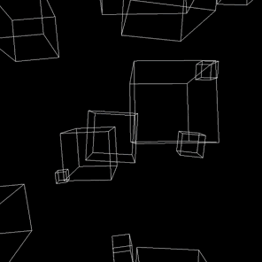

# Cube Rain

If you need a _minimalist_ style for your  
site, but you don't want to write a lot of  
 code, you can use my **Cube Rain** to  
do it using only 3 lines.  



---

## How to use

- Download or copy `cubeRain.js` to your working project.
- Instanciate it and use `init` method to start.
``` js
  import CubeRain from './cubeRain.js'

  const cubeRain = new CubeRain()
  cubeRain.init()
```
- You can change it configurations by `CubeRain.cubeConfig`  
and changing it values.
``` js
cubeConfig = {
    num: , // Number of cubes
    size: { max: , min:  }, // Cube size
    pos: { // Start position
      x: { max: , min:  },
      y: { max: , min:  },
      z: { max: , min:  }
    },
    rotation: { // Rotation speed
      x: { max: , min:  },
      y: { max: , min:  },
      z: { max: , min:  }
    },
    move: { // Movement speed
      x: { max: , min:  },
      y: { max: , min:  },
      z: { max: , min:  }
    }
  }
```
- You can pass a element as parameter to `CubeRain.init`  
to place the animation inside of it.
- The animation happens in a canvas element, so you'll need  
to give it a position absolute if you want it as background.
